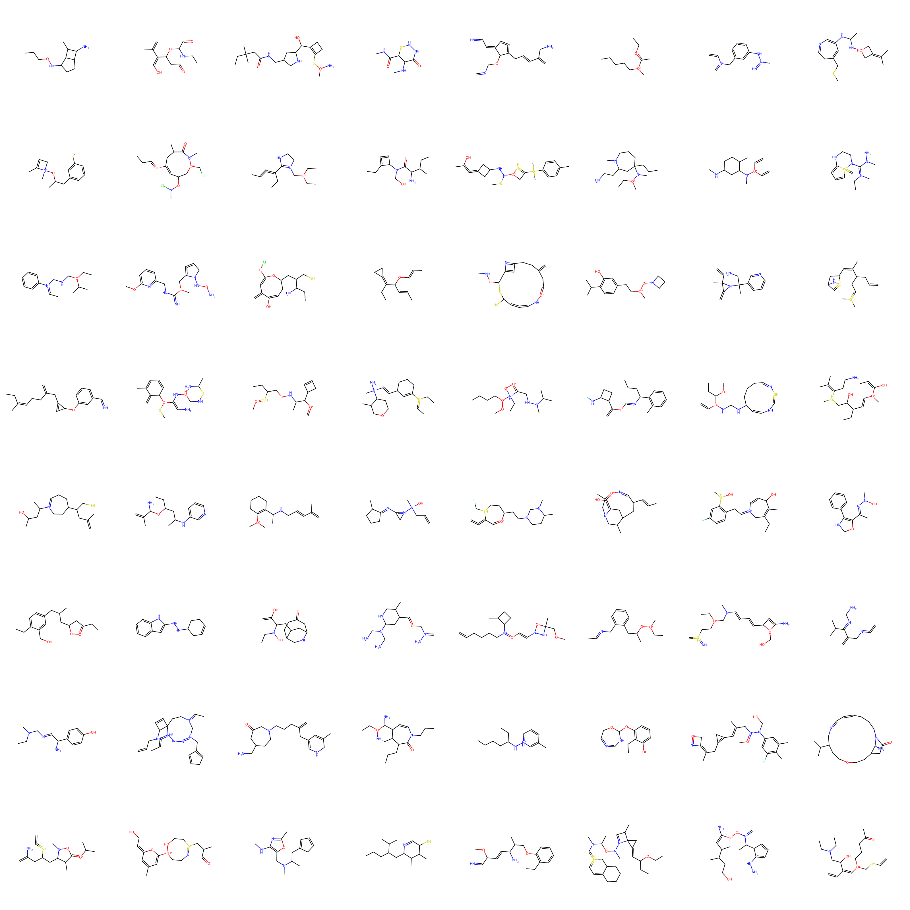
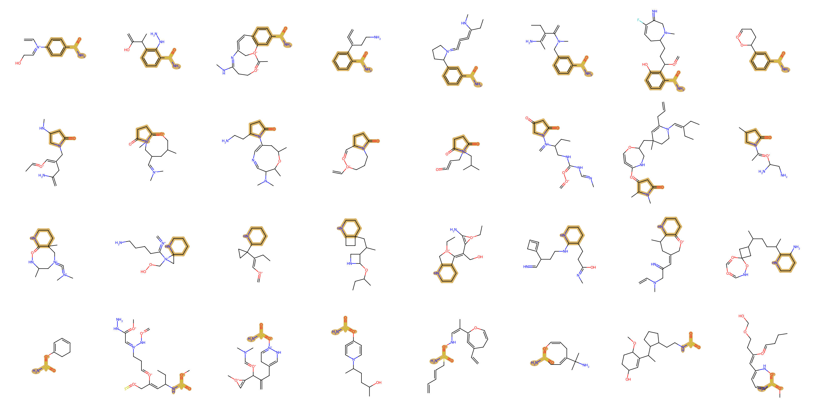

# Sparse Probabilistic Graph Circuits (SparsePGCs)
This repository contains the code for the paper: *Papež M, Rektoris M, Šmídl V, Pevný T. [Sparse Probabilistic Graph Circuits](http://arxiv.org/abs/2503.12162).*
SparsePGCs extend [Probabilistic Graph Circuits (PGCs)](https://github.com/mlnpapez/PGC).

## 1. Install

Clone this repository.
```
git clone git@github.com:rektomar/SparsePGC.git
```

Go to the SparsePGC directory.
```
cd SparsePGC
```

Set up the environment.
```
conda create --name spgc python=3.10

source activate spgc

pip install torch==2.5.1 --index-url https://download.pytorch.org/whl/cu124
pip install rdkit==2024.3.6
pip install tqdm==4.67.0
pip install pandas==2.2.3
pip install pylatex==1.4.2
pip install scipy==1.14.1
pip install fcd_torch==1.0.7
pip install scikit-learn==1.6.0
pip install git+https://github.com/fabriziocosta/EDeN.git
```

## 2. Preprocess
The following command will download and preprocess the QM9 and Zinc250k datasets.
```
python -m utils.datasets
```
## 3. Train
`config/` contains JSON files with the SparsePGC variants' hyperparameters. Change the hyperparameters based on your preferences and then run the following command.
```
python -m train
```
It will train all the SparsePGC variants (or only the selected ones if you change the list of `names` in `train.py`).

The resulting models will be stored in `results/trn/ckpt/`, and the corresponding illustrations of unconditional molecule generation, along with the metrics assessing the performance of the models, will be stored in `results/trn/eval/`.
<div align="center">

</div>

*Unconditional samples of molecular graphs from SparsePGC.*

## 4. Gridsearch
`gridsearch_hyperpars.py` contains hyperparameter grids to find a suitable architecture for the MolSPN variants. Change the hyperparameter grids based on your preferences, and then run the following command.
```
nohup python -m gridsearch > gridsearch.log &
```
This command will run the script in the background, submitting jobs to your SLURM cluster. The resulting models, metrics, and output logs will be stored in `results/gs/ckpt/`, `results/gs/eval/`, and `results/gs/logs/`, respectively.

To reproduce the results in the paper, keep the current settings in `gridsearch_hyperpars.py`. Then, after completing all the SLURM jobs, run the following command.
```
python -m gridsearch_evaluate
```
It will produce Table 1 from the paper (both in the `.pdf` and `.tex` formats).

## 4. Conditional Molecule Generation
Run the following command to generate new molecules conditionally on a known molecule.
```
python -m conditional_sampling
```
To impose a known structure of the generated molecules, change `patt_smls` in `conditional_sampling.py`. Similarly, to select a model from which to generate the samples, change `model_path`.
<div align="center">

</div>

*Conditional samples of molecular graphs from the SparsePGC. The known part of a molecule is highlighted in yellow.*
